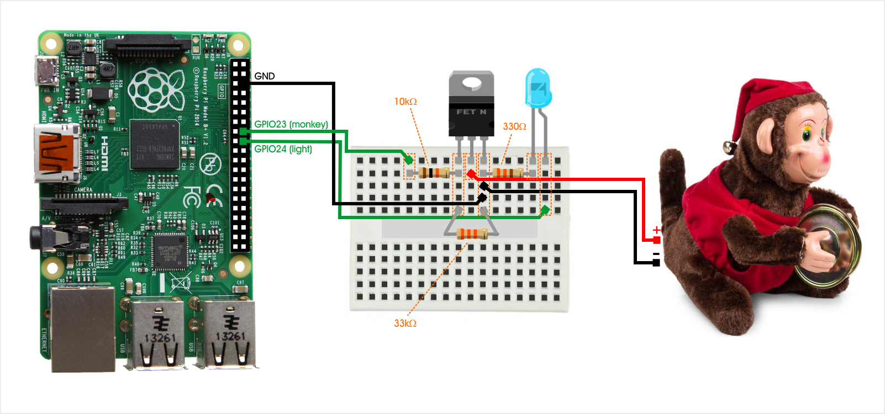

## Complete the Circuit

The complete diagram or Tweet Monkey is as follows...

You can click that image to make it bigger.

This is a very basic circuit. It involves a [MOSFET](http://www.electronics-tutorials.ws/transistor/tran_6.html), an [LED](https://en.wikipedia.org/wiki/Light-emitting_diode), and three [resistors](https://learn.sparkfun.com/tutorials/resistors). I think I've figured out the optimal breadboard layout - one that requires the fewest jumpers and makes the most sense visually.

Your resistor values are important, so be sure to match the colored stripes. The direction you insert the resistors (we call that the polarity) is not important. The direction of the MOSFET and the LED, on the other hand, _are_ important.

The MOSFET should have the tab in the back and the lettering in the front. The LED should have a long leg and a short one. The long one is what we call the _anode_. That always goes on the positive side. In this circuit layout it's on the right.

Next, learn how to [prep your Raspberry Pi](preppi.md).