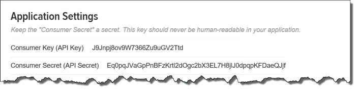
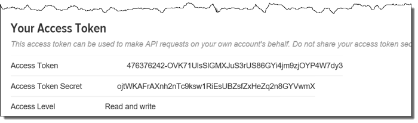

## Sign Up to Use the Twitter API

Before you can use Twitter programmatically, you have to have a Twitter account, you have to register your app (this project), and you have to get some keys so that you're using the API as <i>you</i>.

It's not difficult and it doesn't take long.

First, you sign in to [Twitter](http://twitter.com). If you don't have an account already, you need to create one. For the sake of brevity, I'll assume you've got that part.

Next, go to [apps.twitter.com](http://apps.twitter.com) and click Create New App.

Give your app a unique name. It has to be globally unique and the obvious ones may already be taken, so you might want to prefix it with your initials or something.

You may not have a website, so you can just make something up for that slot. Make sure it looks like a URL. You can leave the Callback URL blank.

Now click the link that says "manage keys and access tokens". Then scroll down and click "Create my access token".

You should now be able to see your Consumer Key (API Key), your Consumer Secret (API Secret), your Access Token, and Access Token Secret.

Copy down those four values because those are what you need to use Twitter from your app. 

Next, learn how to [write the code](code.md).